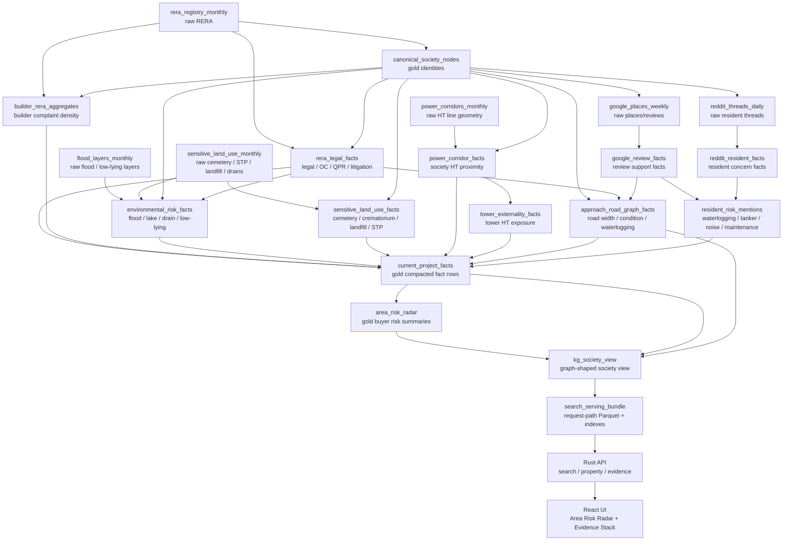

# Area Risk Radar DAG

Status: design placement
Last updated: 2026-07-26

## Product Goal

Area Risk Radar surfaces hidden, decision-critical risks before a buyer pays token money. The feature should answer:

- Does this area flood or sit near poor drainage?
- Is the society close to a lake bed, rajakaluve, open drain, landfill, STP, cemetery, crematorium, or high-tension corridor?
- Is legal/RERA risk visible through litigation, encumbrance, QPR delay, or complaint density?
- Do residents repeatedly mention waterlogging, tanker dependence, noise, dust, or maintenance failure?
- Is the risk area-level, society-level, tower-level, or only a weak resident signal?

This is not a generic "locality insights" widget. It is a buyer due-diligence layer with proof strength and scope.

## Placement Principles

1. Official/map-derived hazards are first-class DAG assets, not review snippets.
2. RERA/legal risk stays inside RERA-derived legal assets and builder aggregates.
3. Resident mentions are early-warning support signals, never authoritative proof by themselves.
4. Tower-level exposure is separate from society-level proximity. A high-tension line near one tower should not mark every unit equally.
5. Heavy joins happen offline during materialization. The request path only reads promoted serving bundles.
6. The UI should show buyer labels such as "Needs tower-level check", not pipeline text such as "source pending".

## Canonical Fact Placement

| Proposed concern | Canonical fact key | Scope | Primary asset owner | Source tier | Notes |
|---|---|---:|---|---|---|
| area_flood_risk | `risk.area_flood_risk` | area, society | `environmental_risk_facts` | official/map | Aggregate flood-prone layer, historical inundation, low-lying evidence. |
| area_low_lying_risk | `risk.low_lying_area` | area, society | `environmental_risk_facts` | official/map | Derived from elevation/flood vulnerability datasets. |
| area_lake_bed_or_drain_proximity | `risk.lake_bed_or_drain_proximity` | society | `environmental_risk_facts` | official/map | Distance to lake, lake buffer, rajakaluve/drain buffer. |
| area_stormwater_drain_proximity | `risk.stormwater_drain_proximity` | society, road_segment | `environmental_risk_facts` | official/map | Keep separate from resident waterlogging reports. |
| nearby_cemetery_or_crematorium | `risk.cemetery_or_crematorium_nearby` | society | `sensitive_land_use_facts` | map/land-use | 2-3 km configurable radius; buyer-sensitive, not a moral judgment. |
| nearby_landfill_or_waste_facility | `risk.landfill_or_waste_facility_nearby` | society, area | `sensitive_land_use_facts` | map/land-use | Include solid-waste plants, dumping grounds, transfer stations. |
| nearby_stp_or_sewage_smell_risk | `risk.stp_or_sewage_smell_risk` | society, area | `sensitive_land_use_facts` + `resident_risk_mentions` | map + resident | Map proximity is not smell proof; review mentions raise confidence. |
| high_tension_line_proximity | `risk.ht_wire_nearby` | society | `power_corridor_facts` | map/utility | Existing key is present; upgrade owner and provenance. |
| tower_high_tension_exposure | `risk.tower_ht_wire_exposure` | tower | `tower_externality_facts` | map/manual | Requires tower footprint or manual tower coordinates. |
| approach_road_width_risk | `risk.approach_road_width` | road_segment | `approach_road_graph_facts` | map/visual | Existing evidence section uses `road_width`; normalize to risk key in DAG. |
| approach_road_condition_risk | `risk.approach_road_condition` | road_segment | `approach_road_graph_facts` | map/visual/review | Existing evidence section uses `approach_road_condition`; preserve buyer label. |
| rera_litigation_signal | `legal.litigation` | society | `rera_legal_facts` | RERA/legal | Existing canonical key is present. |
| rera_encumbrance_signal | `legal.encumbrance` | society | `rera_legal_facts` | RERA/legal | Add if not already present in registry. |
| rera_qpr_delay_signal | `legal.qpr_delay` | society | `rera_legal_facts` | RERA | QPR delay/freshness should be separate from possession delay. |
| builder_complaint_density | `lifecycle.builder_complaint_density` | builder | `builder_rera_aggregates` | RERA/derived | Roll up complaints per project/age/status. |
| resident_waterlogging_mentions | `resident.waterlogging_mentions` | society, area | `resident_risk_mentions` | Reddit/Google | Support signal; can corroborate official flood facts. |
| resident_water_tanker_dependency | `operating.tanker_dependence` | society, area | `resident_risk_mentions` | Reddit/Google | Existing canonical key is present. |
| resident_noise_or_dust_mentions | `resident.noise_or_dust_mentions` | society, area | `resident_risk_mentions` | Reddit/Google | Link to existing `risk.noise` and `risk.construction_dust`. |
| resident_maintenance_failure_mentions | `resident.maintenance_failure_mentions` | society | `resident_risk_mentions` | Reddit/Google | Link to existing maintenance/association keys. |

## Asset Ownership

### Keep Existing Assets

- `rera_registry_monthly`: raw RERA source.
- `rera_legal_facts`: registration, litigation, encumbrance, QPR delay, OC/status.
- `builder_rera_aggregates`: builder complaint density and delivery portfolio risk.
- `approach_road_graph_facts`: road segment, access quality, road width, road waterlogging.
- `society_groundwater_potential_facts`: water context; keep separate from flood risk.
- `google_review_facts`: resident/review support facts.
- `reddit_threads_daily` and `reddit_resident_facts`: code exists, but `asset_registry.json` does not currently list them. Add registry entries before treating Reddit as fully DAG-promoted.

### Add New Assets

| Asset id | Stage | Depends on | Produces |
|---|---|---|---|
| `flood_layers_monthly` | raw | none | Flood-prone polygons, inundation points, elevation/low-lying zones, source watermarks. |
| `sensitive_land_use_monthly` | raw | none | Cemetery, crematorium, landfill, STP, drain/lake/land-use POIs and polygons. |
| `power_corridors_monthly` | raw | none | High-tension line/corridor geometry and utility source metadata. |
| `environmental_risk_facts` | silver | `canonical_society_nodes`, `rera_legal_facts`, `flood_layers_monthly`, `sensitive_land_use_monthly` | Flood, low-lying, lake/drain/stormwater proximity facts joined to society coordinates. |
| `sensitive_land_use_facts` | silver | `canonical_society_nodes`, `sensitive_land_use_monthly` | Cemetery/crematorium, landfill, STP proximity facts with distance buckets. |
| `power_corridor_facts` | silver | `canonical_society_nodes`, `power_corridors_monthly` | Society-level high-tension proximity facts. |
| `tower_externality_facts` | silver | `power_corridor_facts`, `image_media_facts`, optional manual tower coordinates | Tower-level high-tension exposure, if tower geometry exists. |
| `resident_risk_mentions` | silver | `google_review_facts`, `reddit_resident_facts` | Resident early-warning mentions for waterlogging, tanker, noise/dust, maintenance failure. |
| `area_risk_radar` | gold | all risk facts above | Compacted buyer-facing risk cards and proof-strength summaries. |

`current_project_facts` should fan in the new silver assets. `kg_society_view` and `search_serving_bundle` should consume `area_risk_radar` or the risk facts directly, depending on how much summary shaping we want before serving.

## DAG Diagram

## UI Features

### 1. Area Risk Radar

Placement: property detail, above or beside the evidence stack.

Sections:

- Flooding and drainage
- Sensitive surroundings
- High-tension exposure
- Legal and RERA watch
- Resident warnings
- Access road

Buyer labels:

- `Verified risk`
- `Supported risk`
- `Early resident signal`
- `Needs tower-level check`
- `No strong signal found`

### 2. Search Result Risk Chips

Use only the highest-signal risks, not every fact.

Examples:

- `Flood-prone corridor`
- `HT line nearby`
- `RERA watch`
- `Approach road risk`
- `Tanker mentions`

Rules:

- Maximum 2 risk chips on a card.
- Never show raw source names as the chip label.
- A chip opens the proof drawer or jumps to the relevant detail section.

### 3. Compare Page Risk Rows

Add comparison rows:

- Flood/drainage risk
- Sensitive land-use proximity
- High-tension proximity
- RERA/legal watch
- Builder complaint density
- Resident warning count
- Approach road risk

This is where the feature should shine: it turns hidden risk into side-by-side decision clarity.

### 4. Area Tracker Layer

Add optional map layers:

- Flood-prone / low-lying
- Drains / lake buffers
- Sensitive land-use POIs
- High-tension corridors
- RERA watch projects

Do not default all layers on. Use toggles and keep the primary view calm.

### 5. Before Token Checklist

For high-risk facts, generate a deterministic checklist:

- Verify OC/CC and sanctioned plan.
- Check latest RERA QPR and complaints.
- Visit during/after rain.
- Inspect tower distance from HT line.
- Ask residents about water tanker dependence.
- Check approach road at evening peak.

This should be generated from facts, not an LLM paragraph.

## Confidence Model

| Evidence | Max confidence | UI wording |
|---|---:|---|
| Official RERA/legal record | 0.9 | Verified |
| Government or utility geometry | 0.85 | Verified / Map-backed |
| Google Maps/OSM geometry | 0.7 | Supported |
| Google reviews | 0.55 | Resident signal |
| Reddit/forum mentions | 0.45 | Early resident signal |
| Single uncorroborated mention | 0.3 | Needs corroboration |

Combine signals upward only when independent sources agree. For example, STP proximity plus repeated smell mentions is stronger than either alone.

## Implementation Order

1. Add missing fact keys to `concern_taxonomy.json` and `fact_registry.json`.
2. Add registry entries for existing `reddit_threads_daily` and `reddit_resident_facts` support if we want Reddit in the promoted DAG.
3. Add `flood_layers_monthly`, `sensitive_land_use_monthly`, and `power_corridors_monthly` to `asset_registry.json`.
4. Implement silver materializers:
   - `environmental_risk_facts`
   - `sensitive_land_use_facts`
   - `power_corridor_facts`
   - `resident_risk_mentions`
5. Add these assets to `current_project_facts` fan-in and optional dependencies.
6. Add `area_risk_radar` as a gold summary asset or render directly from facts in `kg_society_view`.
7. Add UI surface entries in `ui_surfaces.json` and `app/config/product/evidence_sections.json`.
8. Render the first buyer-facing panel using existing `EvidenceStack` patterns.
9. Add tests:
   - config loader validates new keys
   - materializers produce distance buckets and provenance
   - search card shows max 2 risk chips
   - property evidence includes Area Risk Radar sections

## Naming Notes

Prefer user-problem names over source-specific names:

- Good: `risk.cemetery_or_crematorium_nearby`
- Avoid: `google_cemetery_nearby`
- Good: `legal.qpr_delay`
- Avoid: `rera_qpr_bad`
- Good: `resident.waterlogging_mentions`
- Avoid: `reddit_waterlogging`

## Open Questions

- Do we have enough tower geometry to support `risk.tower_ht_wire_exposure`, or should v1 mark society-level HT proximity as `Needs tower-level check`?
- Which official flood/land-use layers are reliable enough for Bengaluru v1?
- Should `area_risk_radar` be a gold asset, or should the backend assemble sections generically from `ui_surfaces.json`?
- Should cemetery/crematorium proximity be opt-in/collapsed by default because it is sensitive and preference-dependent?

