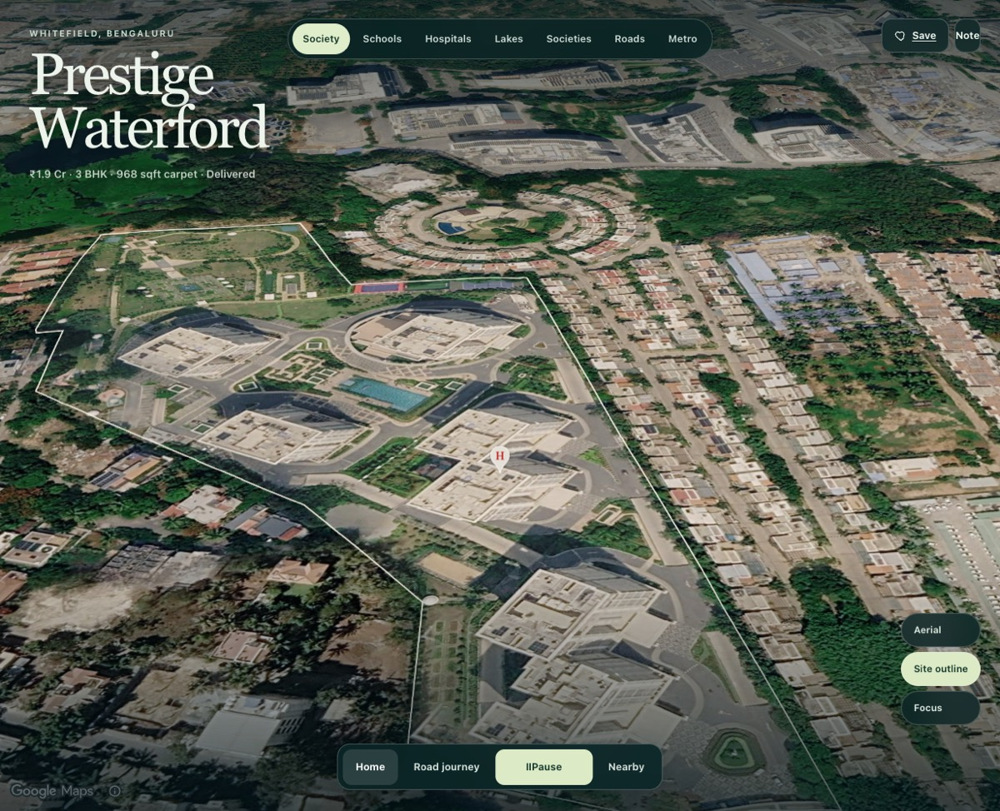
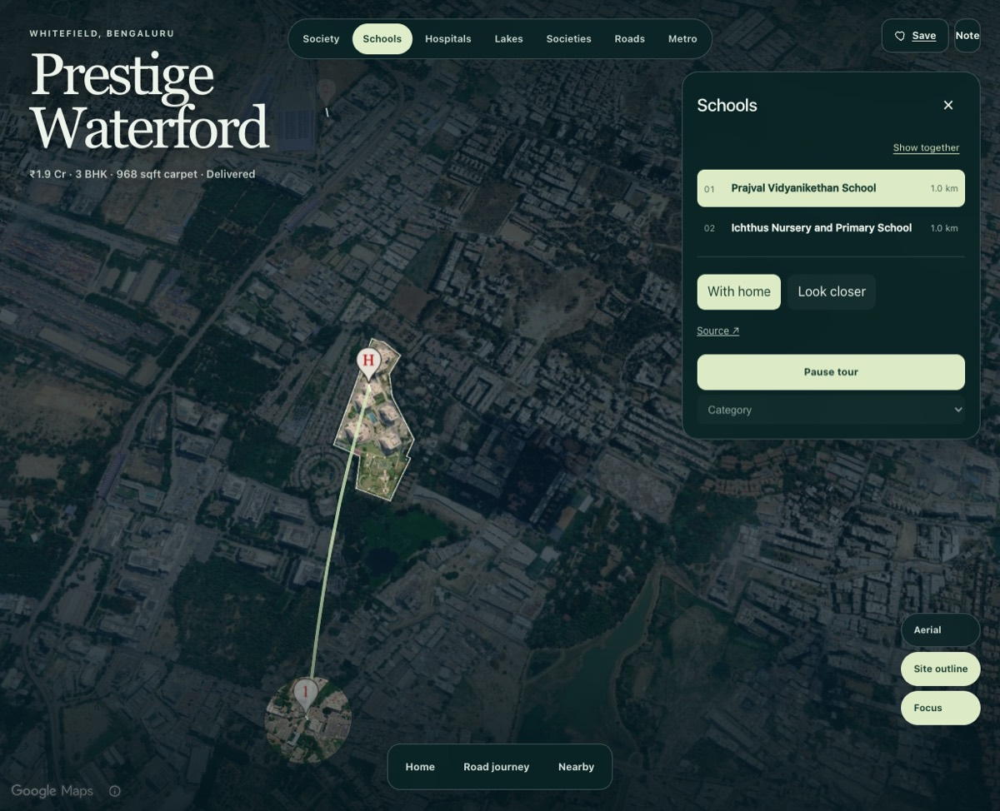
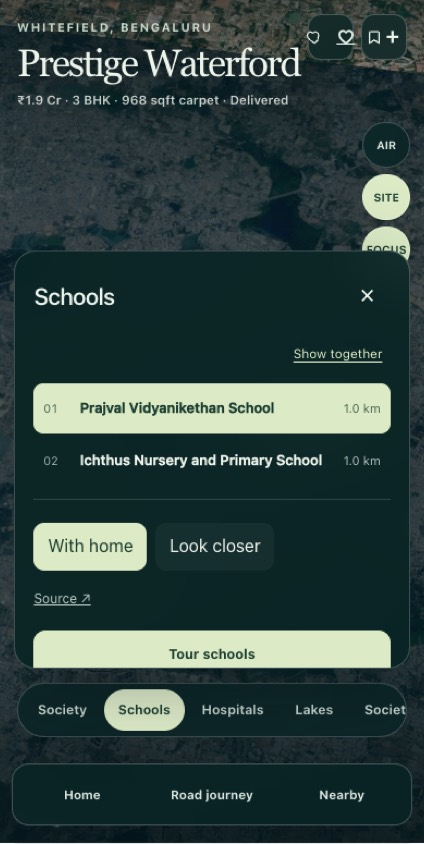

# Atlas nearby parity — integration checkpoint

## Buyer interaction contract

- Category: home plus every API-scoped place and mapped extent. No local distance cutoff.
- Place: home-relative pair framing and an elevated straight-line relationship arc.
- Look closer: inspect that feature's actual geometry; With home restores context.
- Show together: return to the complete category, not the first item.
- Tour: overview, pair, inspection, deliberate pauses, return home. Optional whole-neighborhood scope uses the same control and playback cancellation lifecycle.
- Direct map gestures cancel playback. Pause/resume retains the current stop; reduced motion settles without flight.
- Existing sidebar, road speed control, aerial road driver and Street View exit remain in place.

## Reused learning and code

The local tangent-plane solver in `experiments/home-atlas/src/screenFit.ts` fits sourced home/feature geometry, lifted anchors, and the relationship arc into the measured unobstructed screen rectangle. It accounts for the persistent workspace edge, desktop drawer, mobile bottom sheet, category rail, and journey dock. Heading follows the home/feature bearing plus configured offsets; no category or feature identity changes the camera math. Category timing and camera tuning come from `app/config/ui/home-atlas.json`.

Reviewed Human Atlas `app/scene.tsx`: selected-geometry bounds, distinct selection/isolation states, restrained background emphasis, and user-gesture cancellation. Borrowed those interaction principles and clear-frame fitting, not anatomical meshes, explosion controls, or Three.js architecture. The prior ThreeUI research found no separately established map implementation; no unverified ThreeUI source is claimed.

Rest: category overview shows home plus every API-scoped item. Nearby map pins contain only `H` and numbers; place names stay in the drawer. Hover adds no duplicate place label. Keyboard focus and touch use the same numbered place, `With home`, and `Look closer` actions. Reduced motion applies scene cameras without animated travel. Direct manipulation, hidden-document cancellation, pause/resume position, and Street View return remain intact.

Pair focus borrows Human Atlas's screen-space selection principle: home, the selected place, their sourced extents, lifted markers, and relationship arc are contained in the clear canvas. Inspect uses a closer configured range so selected geometry gains screen presence while home remains a meaningful second anchor. PR 126's overview → pair → inspect → home pacing and 70% move / 30% dwell rhythm are preserved through `AtlasScene`; a camera arbiter makes society, road, and nearby ownership mutually exclusive. The property identity remains a corner overlay rather than a full-height exclusion.

The UI-critic pass removed the stacked `Nearby` heading, redundant place count, arc tutorial caption, source-specific control copy, map popovers, and duplicate accessible place names. Buyer controls are now `Aerial`, `Site outline`, and `Focus`. The mobile evidence drawer is a bounded bottom sheet so a usable map rectangle remains above it.

## Data contract

Overlay lines/polygons retain `entity_id` from `SceneFeature.entityId`. Selection joins shapes using explicit entity identity or exact feature identity, never label or nearest-coordinate guesses. Polygon-only features receive a deterministic extent-center display anchor, not an inferred entrance. Unlinked geometry remains visible in category overview but is not attributed to an unrelated selected pin.

The Waterford API fixture now preserves archived road segments and explicit polygon ownership from the original Atlas data. Production must supply equivalent identities; missing ownership is not repaired with project-specific heuristics.

## Regression coverage

`frontend/tests/home-atlas-integration.test.ts` verifies lake identity, road segment preservation, polygon-only discovery, distant evidence retention, relation-arc endpoints/height, camera ownership, and point/polygon/line containment at near, medium, and distant ranges under translated and rotated coordinates. It also verifies inspect geometry occupies more screen space while the home stays inside the clear frame. Existing playback tests cover cancellation, pause, and resume.

`frontend/e2e/atlas/property.spec.ts` now checks overview/pair/inspect states and relation arc creation/removal, and captures schools-together and school-with-home screenshots when run against real Google 3D.

## Verification gate

Focused real-Chrome verification covers desktop category overview, pair, inspect, tour pause/resume, road direction, Street View return, and the `390×844` bottom-sheet composition with no page errors. The raw UI-polish frames, trace, video, and three-frame contact sheet are under ignored test storage at `frontend/test-results/atlas-parity/ui-polish-check/`.

| Society rest | Schools pair | Mobile bottom sheet |
| --- | --- | --- |
|  |  |  |

The default production build requires `VITE_API_BASE` and `VITE_SITE_URL`; configure the actual deployment origins rather than baking placeholder addresses into the application. Local review uses the Atlas build mode and backend fixture API. A configured Google Maps key and WebGL-capable browser are still required for the real map.

Two consecutive timing-enforced full journeys passed under `frontend/test-results/atlas-parity/final-parity-timing-1/` and `final-parity-timing-2/`. The trace contract keeps overview, pair, inspect, and home dwell within 5% of configured reference timing while also checking monotonic road distance, persistent map identity, exact pair marker/arc counts, and zero page errors. The local API loaded promoted catalog `catalog-71-ffb4dc50-117e-453c-b26f-41822430324e` (159 properties); the promoted Prestige Waterford response served the exact OSM home boundary and four scoped arrival features. The public API returned HTTP 503 during final verification, so local promoted-bundle verification is the recorded production-boundary check.

Attach the representative resting and focus screenshots from the recorded artifacts when the branch PR is opened. Browser DOM assertions do not by themselves prove photographic composition.

Not added: idle orbit, saved exact viewpoints, township split-layout, or synthetic building extrusion. These are optional enhancements, not prerequisites for nearby parity. Do not reintroduce Lift or map comparison.

## Follow-up: selection composition and Aerial fitting

Reviewed PRs 132 and 133 together, the committed schools-pair screenshot, and
[Human Atlas's actual scene implementation](https://github.com/ashemag/human-atlas/blob/553f1db7e23b872cdffcec01fba8e59b88053551/app/scene.tsx).
Human Atlas centres isolated selection bounds in the space remaining beside its
inspector. Here, home must remain visible too: inspection now uses spare framing
space to move the selected anchor toward the clear-frame centre, constrained by
home, selected geometry and relationship-arc bounds. Range is unchanged by this
composition adjustment; geographic distances and geometry are never altered.

Fixed an independent bug: the Aerial control previously replaced tilt *after*
fitting, invalidating containment. It now supplies its tilt to the same solver
before centre and range are calculated. Both changes use the existing camera
owner and persistent map; no new camera loop or control is introduced.

Interaction note:
- Rest / Show together / With home: retain balanced context framing.
- Look closer: prefer the selected subject within the available containment slack.
- Hover: unchanged; no automatic camera movement or duplicate labels.
- Keyboard / touch: existing selection controls use the same fitting path.
- Reduced motion: existing zero-duration camera application is unchanged.
- Not borrowed: anatomical explosion, mesh lifting, artificial lighting of real
  geography, auto-orbit, or isolated views that discard the home's relationship.
- ThreeUI search did not establish a directly relevant primary-source map pattern;
  no ThreeUI implementation is claimed or introduced.

### UI critic — immersive property detail

Should-fix: inspection previously balanced the entire relationship rather than
prioritising its selected subject; addressed within the existing controls.
Aerial containment was a correctness issue; refitting addresses it.
The existing screenshot's strong dark veil merits live tuning, but no shade
change is justified without checking real photographic rendering.
Passes: no added headings, facts, floating cards, tutorials or decorative motion.

### Verification scope and remaining visual gate

Added regression coverage for final-tilt Aerial containment on desktop/mobile,
and selection-centred composition with unchanged scale and retained home across
desktop, portrait and landscape frames. Existing geometry-presence tests remain.
These test the local tangent-plane approximation, **not Google's actual
perspective, terrain occlusion, or photographic composition**.
Validation passed: 274 frontend tests, 16 Atlas experiment tests, TypeScript,
ESLint, Atlas build and `git diff --check`. The build retains the existing large
chunk warning. This workspace ran Node 24 rather than the repository's Node 22
engine; CI on the pinned engine remains required.

This follow-up workspace has no configured Google Maps key. The earlier images
and browser results above predate this follow-up and are not after screenshots.
Real-Google desktop/mobile screenshot and interaction verification remains a
merge gate. Run the existing Atlas browser suite with an authorised key and
capture pair, Look closer and Aerial for schools and lakes before merging.
Specifically verify distant selections, terrain/building occlusion, rapid
selection changes, gesture cancellation and Street View return.

At that checkpoint, further camera/shade tuning was pending. The next follow-up
below implements comparison orientation and a provisional lighter shade;
road-vantage adjustments and live visual evaluation remain pending. A straight
relationship arc must never be presented as a walking or driving route.

## Comparison tuning follow-up

With home now derives its heading from the entire category, as Show together
does. Switching between alternatives no longer rotates the map toward each new
place. Its tilt remains fixed; centre and range still fit each relationship.
This preserves orientation, not a shared zoom scale. Look closer intentionally
retains the subject-facing angle: applying the category heading there failed the
existing selected-geometry prominence test. The two actions therefore have
distinct jobs without adding controls. Selecting the next place returns to pair
framing through the existing selection handler.

Reduced the Focus veil alpha from 176/255 to 112/255 (about 69% to 44%) so more
intervening geography remains visible. Existing home/selection cutouts, source
geometry and layer colours are unchanged. This is a provisional visual tuning
value, not a claim of photographic validation.

Regression coverage exercises alternatives on opposite sides of home, list
reordering, desktop/mobile frames and home/arc containment. The existing inspect
prominence and Aerial containment contracts still apply. Hover, touch, keyboard
selection and reduced-motion dispatch are unchanged; no new copy or chrome.
Validation: 275 frontend tests, 16 Atlas tests, ESLint, TypeScript, Atlas build,
and `git diff --check` passed. Existing large-bundle warning remains.

Live-render verification remains blocked by the missing configured Maps key.
No new screenshots are claimed. Road pauses remain unimplemented: the current
continuous route contract has no explicit junction-stop collection. Do not turn
polyline bends, regular waypoints or guessed entrances into buyer stops. A
follow-up needs sourced stop identities and route associations, then verification
of pause/resume, speed changes and Street View handoff on the real map.

## Cosmetic and control pass from the three supplied screenshots

The reference screenshot gives the geography more space than the PR frames.
The PR lake views also show dark circular patches inside highlighted polygons.
The renderer was creating both polygon holes and circle holes for the same
identified lake. Removed that duplicate: point-only evidence retains circles,
while mapped places use their sourced extent. Tests cover overview, isolated
selection and the missing-polygon fallback. This does not claim arbitrary
overlapping polygons are unioned; only duplicate point/extent cutouts are fixed.

UI changes:
- Compact the property title while exploring; keep the original Home identity.
- Reduce top/bottom shading so the canvas is less dim around its edges.
- Put Top view, Site outline and Dim surroundings in one native Map view
  disclosure. Keep full readable labels on mobile, replacing AIR/SITE/FOCUS.
- Use a narrower, lighter drawer, restrained selected rows, and a joined
  With home / Look closer control. Keep source links and stable numbering.
- Remove the tour-scope selector and neighborhood-wide tour option. The single
  tour action now always tours the visible category; pause/resume is retained.
- Remove the duplicate Society shortcut from the nearby rail; Home remains in
  the bottom journey navigation, whose active modes expose pressed state.

UI Critic: no extra fact cards or instructions were added; the map receives
more visual space and only the tour action gets the strongest drawer fill.
Keyboard users can open Map view with Enter and tab through the settings.
Touch targets remain at least 44px on mobile. The title resize transition is
disabled for reduced motion. React review retained existing camera ownership,
lazy loading and event-driven selection; no new runtime dependencies or loops.
Borrowed Human Atlas's compact inspection hierarchy, not its mesh manipulation.
The earlier ThreeUI research still provides no verified map-specific source.

Validation: 276 frontend tests, ESLint, TypeScript and Atlas build pass (existing
large-chunk warning). Browser spec now covers collapsed settings, top-view
toggle, keyboard disclosure on mobile and absence of the removed tour selector.
That browser spec has **not run** for this pass. A supplied Maps key was used only
in the dev-server environment, never written into source or committed.

Visual gate remains open for environment reasons: the local browser daemon
failed, official Chrome download hit a certificate error, the Playwright Chrome
download timed out, and the cloud browser refused localhost. The PR's deployed
Vercel preview requires sign-in. No after screenshots or real-Google visual pass
are claimed. Review desktop/mobile lakes, pair/inspect/top views, Map view menu
overlap, brightness and road/Street View controls in an authenticated preview
before merge. The supplied screenshots informed the changes but are not after
evidence. This pass changes no additional camera angles or sourced road data.
