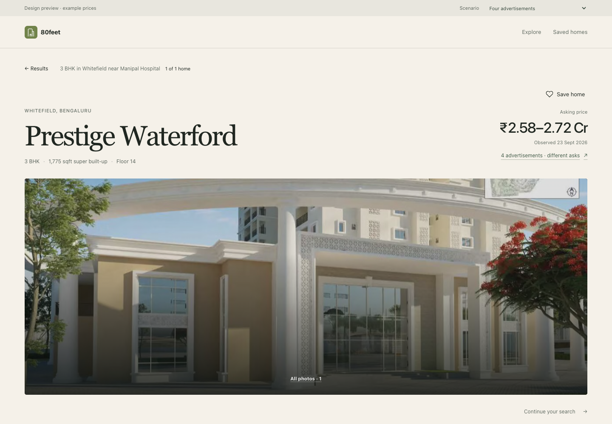
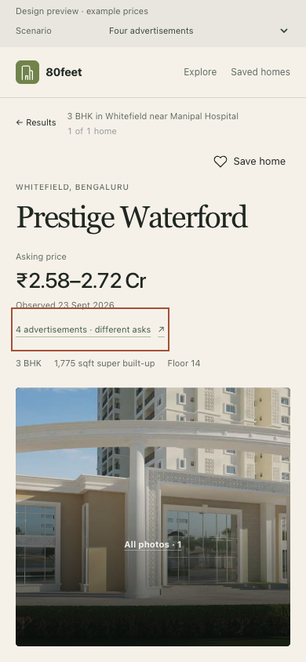
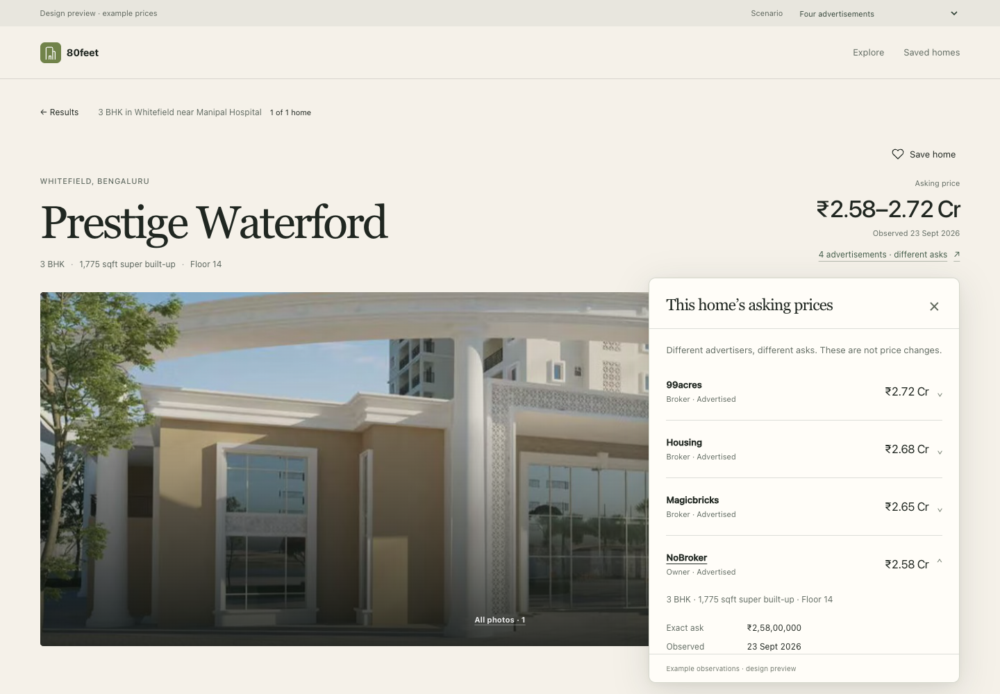
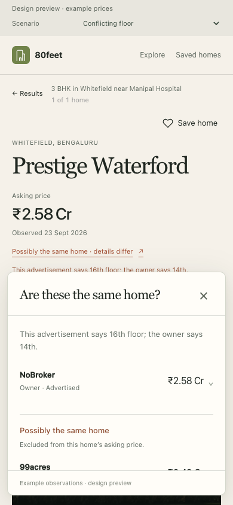

# Inventory Truth — issue #148

## Buyer footsteps, before components

Search carries “3 BHK in Whitefield near Manipal Hospital”. The result represents
one explicitly bound home, not a society price band. Arrival retains that sentence
and the result position. In the first three seconds: recognise the property and
configuration; read the asking range. By ten seconds: notice one useful clue
(different asks, a floor disagreement, or no active advertisement). Inspect that
clue, read the source row that answers it, optionally open its receipt, then close
and continue at the same position. Save refers to the home ID.

Inspected: PropertyPage (atlas and photographic branches), PropertySceneCard,
PropertySearchRail, LandingStoryStage/BrowsePropertyTile, SaveHeartButton,
property-scene.css, property-arrival.css and the stone/clay design tokens.
Desktop/mobile baseline: `/tmp/inventory-clean-{desktop,mobile}.png`.
The existing atlas could not render Google locally; its identity, navigation and
photo interaction remained inspectable. The original checkout also has an
unfinished merge and a missing frontend dependency. Work is isolated at
`openestates-issue-148`, based on `7e3bb6bf`.
The review branch was subsequently rebased onto `c11e00ef` (current main) and
revalidated; the shared story model's retired arrival field was removed.

## Three structural proposals

These are placement wireframes, not alternative colour themes. Each retains the
current property identity, media, save action and search sentence.

| | First viewport | First interaction | Deep detail | Mobile | Cost |
|---|---|---|---|---|---|
| A: Inline price footnote | Title / facts / price / photograph | Source rows expand between identity and media | Receipts expand in document flow | Same structure, single column | Predictable but pushes the home photograph away; deep inspection moves the page |
| B: Price-anchored evidence layer | Title and facts left, price and one clue right, photograph below | A compact layer opens under the price; sources and asks align on separate rows | Individual receipt opens inside that layer; comparison and registration have separate disclosures | Layer occupies the width below the identity, with its own bounded scroll area | Requires careful focus, edge collision and scroll restoration |
| C: Compact edge tray | Existing identity and price; clue beside price | Side-by-side property and a narrow evidence column | Receipt replaces tray contents with an explicit back control | Bottom sheet with the home identity left visible | More navigation and a second layout; risks recreating the rejected dashboard |

```text
A resting             A first click            A deep
Title       Price     Title       Price         Title       Price
Facts       clue v    Facts       close         Facts       close
[     home photo ]    sources / asks             source / full receipt
                      [     home photo ]        [ photo moves down ]

B resting             B first click            B deep
Title       Price     Title       Price         Title       Price
Facts       clue v    Facts       close         Facts       close
[     home photo ]    [ photo | source / ask ]   [ photo | receipt   ]
                      [       | other sources]  [       | scroll    ]

C resting             C first click            C deep
Title       Price     Title    | sources         Title    | < Sources
Facts       clue >    Facts    | asks            Facts    | receipt
[     home photo ]    [ photo ]|                 [ photo ]|
```

## Choice: B, a footnote attached to the price

The first question is “Why are the prices different?”, not “Show me a market
dashboard”. A small anchored layer answers directly while leaving the title,
search intent and much of the photograph visible. No dimmed backdrop or modal
takeover. No chart connects prices from different advertisers.

Default: identity and physical facts once, honest eligible asking range, absolute
observation date, one evidence trigger. An identity conflict or absent active ask
is visible before interaction. Uncertain candidates never broaden the confirmed
home's price range. Unknown price is omitted, not zero. A single source gets a
single receipt, with no empty comparisons or faux history.

First interaction: who advertised this home, their ask, seller type as advertised,
and explicit availability. Deeper: receipt IDs, source link when real, first/last
seen, supported same-ad price revisions, agreements/conflicts, other active homes,
reliable registrations. Source URLs in mocks are absent rather than fake portal
links. Registered amounts never enter asking ranges.

Mobile: keep property identity above a bounded evidence layer; generous 44px
targets, wrapped source names, independent scrolling. Escape, the close control,
and outside click dismiss. Focus returns to the exact opener without scrolling.
No gesture is required. Opening does not change the route or search parameters.

Saved homes use the same canonical ID and API summary. A future “What changed?”
requires an explicit previous snapshot/revision and durable event evidence. This
prototype must not infer changes from save time or manufacture return deltas.

Failure: a compact retry action beside the price area. Empty evidence: no trigger.
Long source names wrap without displacing amounts. No raw confidence percentages,
status-pill rows, source logos, promotional copy, or decorative charts.

## Interaction research / PR note

Inspected `MengTo/threeui` main, including `src/components/SearchDialog.tsx` and
the package-component inventory. Its anchored tooltip uses viewport collision
handling, hover/focus parity, and suppresses video previews under reduced motion.
There is no directly applicable persistent receipt disclosure. Borrow the spatial
relationship and edge containment, not the search modal, hover-only previews,
WebGL, shader visuals or timers. Rest: one underlined clue. Hover: underline and
ink change. Focus: visible outline. Touch: explicit toggle and close. Reduced
motion: immediate presentation; normal motion is only a short opacity change.

## Backend scope added by the user

Mock input → typed Parquet snapshot → Rust startup aggregation → Axum API →
generated/validated TypeScript → the shared property scene. The isolated preview
must never publish mock prices into production APIs, search indexes or the lake's
current pointer. No canonical matching algorithm or ingestion rollout is included.

The projection must preserve provider + advertisement identity, individual
observation IDs, explicit home bindings, amounts in integer INR, seller roles,
availability, area basis and revision links. Timestamps are provenance only;
explicit current markers and predecessor references select observations/history.
Eligible exact-home active asks determine min/max. Likely matches, stale/removed
ads, comparable homes and registrations remain separately inspectable. No average
or preferred portal is silently promoted as the home's asking price.

Pin catalog/detail to a content-addressed snapshot; reject stale reads. Validate
duplicate observation IDs, contradictory current records, dangling/cross-ad
revision links, inconsistent measurements and unbound records before serving.
Prove this through one materialize → load → API integration contract, including
row-order invariance and deliberate broken inputs. #144 remains the production
domain/matching/persistence workstream.

## Verification record

The implemented preview reuses the existing photographic PropertySceneCard and
PropertySearchStrip, rather than the unavailable Google renderer. It is a separate
entry point; the production property route and backend are unchanged. The shared
photo component, facts, search context and save journey establish the integration
seam. A future atlas integration can supply the same InventoryEvidence component
at its identity/price location without introducing a second projection.

### Screenshots

| Desktop | Mobile |
|---|---|
|  |  |
|  |  |
|  |  |

Additional captures of every fixture state, 320px layout, price history and long
source labels are generated under `frontend/test-results/inventory`.

### UI critic — property and evidence

Blockers: none remaining in the inspected 1440px, 390px and 320px views.

Fixed: the reused search strip was hidden on desktop and inherited a pill shell
on mobile; the preview now renders it as plain contextual text. The existing
oversized “Exterior” caption competed with the title; this view omits that caption.
Repeated same-home explanations are collapsed in the identity disclosure while
each source receipt retains its own binding. Registration rows say “Registered
sale”, not listing availability. Same-ad price changes open their history on the
first interaction. A snapshot mismatch can reload the catalog through the return
action rather than retrying the old snapshot forever.

Passes: one default price range; no price chart connecting different ads; no
decorative card around property facts; title/photo remain dominant; uncertainty
is visible before the evidence opens. No confidence meter, default raw receipt
IDs, invented source URLs or date-based availability. The mobile panel scrolls
independently, leaves the property identity visible and requires no gesture.

The React best-practices review kept the bundle isolated from production, made
scroll listeners passive, versioned preview storage, and retained cancellation
and runtime schema checks at the API boundary.

### Checks

- Rust: two integration/admission contracts covering Parquet → API, all ten
  scenarios, price witnesses, same-ad deltas, catalog/detail equality, row-order
  invariance, timestamp independence, invalid bindings/history and tampering.
- Rust `cargo clippy --all-targets -- -D warnings`: clean.
- Frontend: lint, prototype typecheck/build, production typecheck/build, and all
  307 existing frontend tests pass on current main. The main build reports existing mixed JSON
  import-attribute and large-chunk warnings.
- Four browser journeys pass against the real preview API: search/save/return,
  all fixture states, keyboard/touch/mobile/reduced motion, and failures including
  snapshot rejection and recovery. No API mocks in the success journeys.
- `git diff --check`: clean.

These are new design contracts, not claims of coverage for a production matcher.
Visual inspection caught the inherited hidden-context and caption issues; the
API tests encode and enforce the new aggregation invariants. Source collection,
real matching, promotion and durable saved-home change events remain #144.

Run commands and storage/API details: [preview README](../frontend/prototypes/inventory-truth/README.md).
