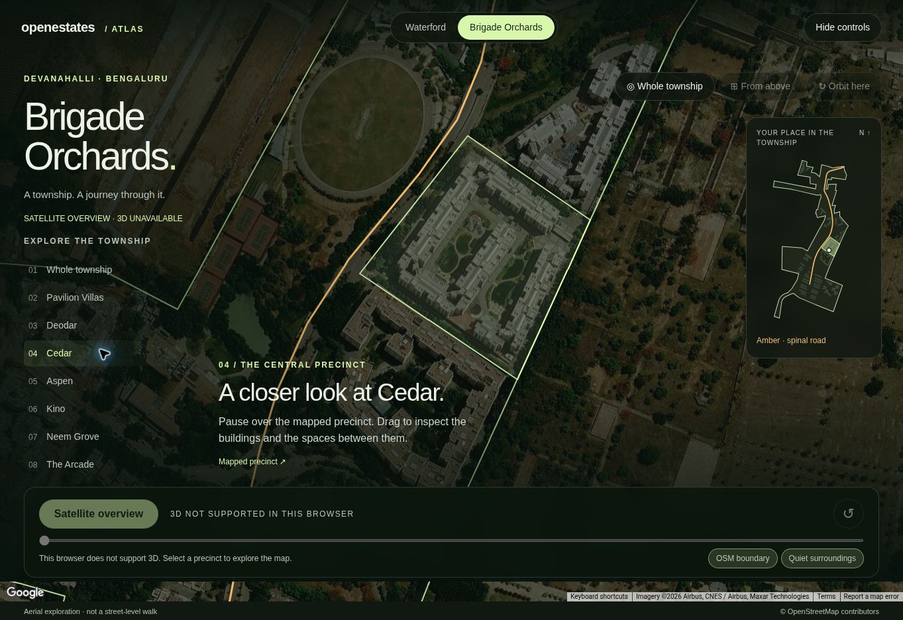

# Home Atlas experiment handoff

This folder preserves the accepted Waterford neighborhood explorer and Brigade Orchards township journey while keeping them outside the buyer-facing application. It also extracts the reusable presentation and journey maths against OpenEstates' existing `SurfaceSceneResponse` geometry.

The purpose of this experiment is to make the next integration smaller. It is not a second map platform, a new source of truth, or a production UI route.

Live reference: [OpenEstates Home Atlas](https://openestates-home-atlas.guluuu3.chatgpt.site/)

Preserved prototype checkpoint: `b39ecc1` (`Drive Brigade shell from atlas presentation policy`).



The screenshot is the tested satellite fallback. Photorealistic 3D requires WebGL2 and must be reviewed in a supported browser before release.

## What is preserved

- Waterford: society arrival, nearby societies, multiple schools and hospitals, roads, metro, lakes, OSM boundaries, category tours, road-aligned aerial descent, optional Street View, and reversible focus.
- Brigade Orchards: a township overview, persistent locator, continuous aerial travel along a mapped spinal road, precinct focus, OSM boundary emphasis, and quiet visual isolation.
- Interaction invariants: user gestures cancel automatic movement, pause/resume does not create competing loops, reduced motion avoids continuous animation, and unavailable Google rendering fails honestly.
- Data caveats: OSM geometry is mapped context rather than a legal boundary; straight-line distance is not travel time; Google renders imagery and terrain but does not own durable map truth.

The earlier artificial lift and illustrative tower study are intentionally not included. They were rejected during review and should not return through accidental code reuse.

## Folder shape

| Path | Role |
|---|---|
| `prototype/` | Runnable snapshot of the accepted Waterford and Brigade experiences |
| `prototype/web/brigade/inventory.json` | Single canonical Brigade fixture used by the prototype and tests |
| `core/presentation.ts` | Configurable society/estate/township policy over `SurfaceSceneResponse` |
| `core/journey.ts` | Renderer-independent route projection, journey timeline, and camera blending |
| `tests/` | Contract tests using a small society and the real Brigade OSM fixture |

Society-specific names and OSM identifiers remain only in prototype fixtures and acceptance tests. The reusable core selects routes and presentation from typed layers and geometry.

## Production contract

OpenEstates already has the right spine:

```text
OSM/Google collectors
  -> DAG facts and relationships
  -> promoted serving bundle
  -> Rust SurfaceSceneResponse
  -> presentation + journey planner
  -> Google 3D renderer and React controls
```

Do not promote `prototype/web/atlas-document.js` or the Brigade inventory shape into a second API. Production code should continue to consume `SurfaceSceneResponse`, `SceneFeature`, `SceneLayer`, `SceneReceipt`, and `ProofFocus` from the existing surface endpoints.

| Prototype idea | Production owner |
|---|---|
| Boundary, internal road, precinct, building and amenity geometry | DAG facts and serving bundle |
| Source URL, confidence and freshness | `SceneReceipt` |
| Society/estate/township thresholds and camera budgets | versioned config under `app/config/dag/` |
| Resolved profile, eligible route and ordered stops | Rust scene projection |
| Camera interpolation and exact route projection | renderer-independent TypeScript |
| Playback cancellation, pause/resume and reduced motion | existing `ArrivalPlaybackController` |
| Google loading, terrain and Street View availability | existing `googleMaps3d.ts` boundary |
| Buttons, captions, locator and focus UI | React property-arrival components |

## Integration sequence

1. Extend the configured surface scene with internal-route, precinct and building layers. Do not add property or society IDs to frontend code.
2. Materialize continuous route eligibility and precinct relationships offline. A named road alone is not sufficient evidence for a tour.
3. Let the Rust surface builder resolve the profile and emit an optional journey plan referencing returned feature IDs.
4. Move the `core/` functions into `frontend/src/lib/` once the API fields exist. Reuse `ArrivalPlaybackController` and `googleMaps3d.ts`; do not copy either prototype `app.js` controller.
5. Render non-anchor polygon features directly from `SurfaceSceneResponse`. The legacy `PropertyMapContext` adapter currently drops those polygons.
6. Add one `Explore society` mode to the property-arrival surface. Small societies retain the Waterford composition; qualified townships gain the Brigade locator and route journey.
7. Validate Waterford and Brigade as acceptance fixtures before widening to other societies.

## Run the preserved prototype

```bash
cd experiments/home_atlas/prototype
npm ci
npm run check
npm run dev
```

Provide `VITE_GOOGLE_MAPS_API_KEY` through a local ignored environment file. Browser Maps keys are visible to viewers and must be restricted by API and allowed origin. No credential or Sites project identity is stored here.

Run the production-shaped core checks from the repository root:

```bash
frontend/node_modules/.bin/tsc -p experiments/home_atlas/tsconfig.json
node --experimental-strip-types --test experiments/home_atlas/tests/*.test.ts
```

## Review gates for later wiring

- Scene/API contract remains camelCase and versioned in Rust and TypeScript.
- Polygon and line coordinates stay GeoJSON order: `[longitude, latitude]`.
- Route direction is resolved upstream from mapped direction/access and explicit entrance facts; the camera core preserves that order and never reverses it from latitude or visual guesswork.
- Only one continuous line is followed until a validated connected road graph exists.
- Labels are budgeted by profile; building footprints become texture in a township rather than hundreds of labels.
- “Quiet surroundings” remains a focus treatment, not a claim about real noise.
- No external API call enters the Rust request path.
- Buyer-facing copy stays compact and does not expose ingestion or renderer jargon.
